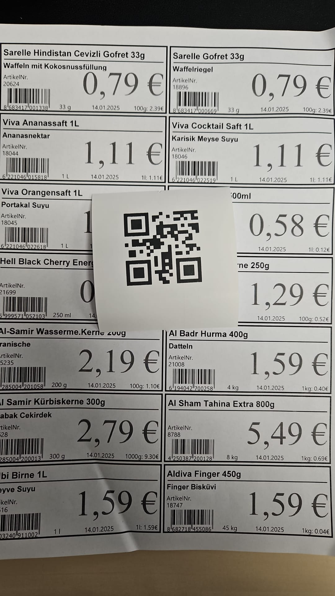

# Android-USB-QR-Barcode-Scanner
Android-USB-QR-Barcode-Scanner

USB Barcode/QR-Code Scanner Integration in Android App

Basis:
https://stackoverflow.com/questions/34411919/android-and-external-usb-barcode-scanner-how-catch-the-enter

Hem Activity hemde Fragment içerisinde USB barkod okuyucu entegrasyonu yapılabilir.

## Screenshots

